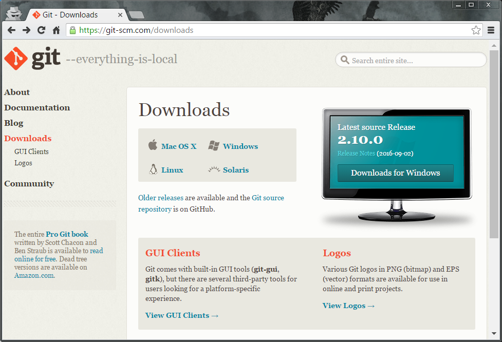

# Установка софта

- Node.js
- Webstorm
- GIT

## Установка Node.js

Переходим по ссылке: https://nodejs.org/en/download/current/  
Выбираем нужную ОС и формат:  
  

### Установка под Windows

Нажимаем на 32 или 64 битный установщик (.msi) в зависимости от вашей системы. После скачивания файла установщика запускаем его.  
Нажимаем Next:  
  
Отмечаем что согласны с условиями лицензии:  
  
Выбираем путь куда буде установлен Node.js:  
  
Настройки оставляем по умолчанию:  
  
Нажимаем Install:  
  
Ждем пока Node.js установиться о чем нам сообщит следующие окно:
  
Нажимаем Finish.  
Установка завершенна. Поздравляю!  
Проверим или все установилось правильно. Запускаем окно командной строки (Command prompt). Для этого зажав кнопку WIN нажимаем кнопку R. В открывшемся окне пишем ***cmd*** и нажимаем OK.  
  
В открывшемся окне пишем команду ***node –v*** нажимаем Enter. На экране должна отобразиться версия установленного Node.js:  

## Установка Git

Переходим по ссылке: https://git-scm.com/downloads
Выбираем нужную ОС и формат:

### Установка под Windows

Читаем условия лицензии, и нажимаем Next:

Отмечаем все пункты в настройках (создание иконки на рабочем столе, интеграция с проводником, установка программы по умолчанию для файлов с расширением .git, .sh), нажимаем Next:

Оставляем  настройку по умолчанию (команда git будет доступна в окне командной строки), нажимаем Next:

Оставляем настройку по умолчанию (настройка символа конца строки при checkout и commit), нажимаем Next:

Оставляем настройку по умолчанию (настройка эмулятора терминального  окна), нажимаем Next:

Оставляем настройку по умолчанию (дополнительные настройки кэширования и доступа), нажимаем Install:

Ждем пока установка завершится. Отмечаем первую опцию (запуск терминала Git Bash), нажимаем: Finish:

Должно запуститься терминальное окно. Набираем команду ***git --version***. Если все прошло успешно, то отобразится установленная версия Git:

## Установка Webstorm

IDEA Webstorm — IDE для веб-разработки, включает в себя поддержку HTML, CSS, JS (клиентского и серверного NodeJS), GIT.

Перейти по ссылке: https://www.jetbrains.com/webstorm/download/
Выбираем нужную ОС:

### Установка под Windows

Запускаем установку. Нажимаем Next:  
  
Выбираем путь куда буде установлен Webstorm:  
  
Выбираем типы файлов, которые по умолчанию будут открываться в Webstorm. Нажимаем Next:  
  
Оставляем название папки в стартовом меню по умолчанию.  Нажимаем Install:  
  
Запускаем Webstorm после установки для настройки. Нажимаем Finish:
  
При первом запуске программа попросит указать файл с конфигурацией. Если такого нет то отмечаем последний пункт:  
  
Читаем и принимаем политику конфиденциальности:  
  
Отмечаем что будем использовать пробный 30 дневной период. Нажимаем Evaluate::  
  
Принимаем условия лицензии. Нажимаем Accept:  
  
В низу окна нажимаем Configure и выбираем первый пункт меню - Settings:  
  
Переходим к настройке.

### Настройка

1. Выбор версии языка javascript:

   1. Preferencies > Languages & Frameworks > JavaScript
   2. установить значение: **ES 2015+ (ECMAScript 6)**

  

2. Настройка github
   TODO
